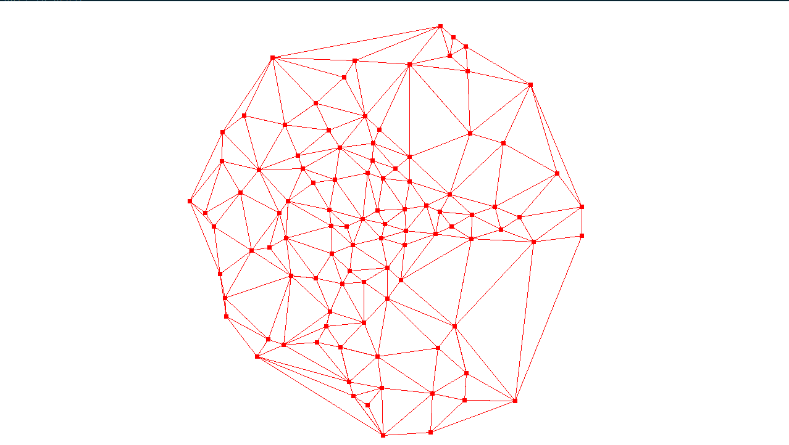

# Delaunay-Triangulation
This project is implementaion of delanuay triangulation in c++

## Compilation
### Linux
- ```make lib``` - creates .so lib file
- ```make``` - creates example binary
### Windows 
Projects should be compatible with visual studio

## Example
Example visualisation using SDL2

